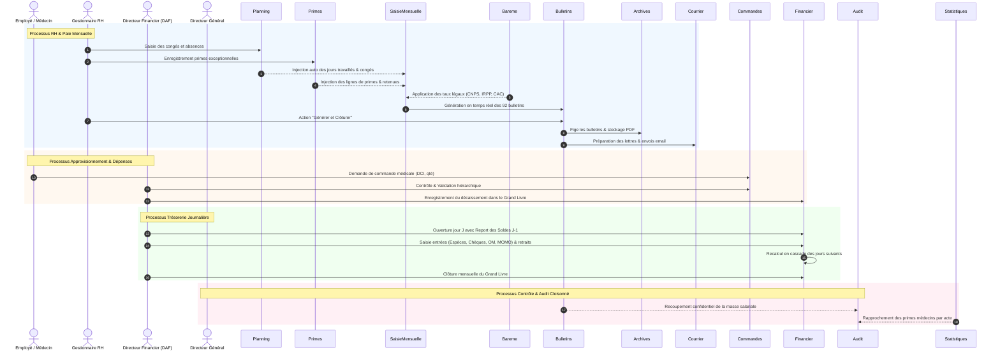

# Guide Explicatif & Pédagogique : Niveaux d'Accès, Interactions entre Onglets et Règles de Calcul

> **Plateforme « Polyclinique de Poitiers » (Poitiers Coworking)**  
> *Système de gestion hospitalière, financière, RH, paie et exploitation médicale.*

Ce document a été conçu pour vous apporter une compréhension intégrale, claire et pédagogique de la plateforme :
1. **Les différents niveaux d'accès (RBAC)** : qui a accès à quoi et pourquoi.
2. **Chaque onglet pris isolément** : sa fonction unique, ses données et ses actions.
3. **Les interactions croisées entre onglets** : comment les informations circulent de l'un à l'autre selon qui est connecté.
4. **Les règles et formules de calcul** : le détail pas-à-pas des algorithmes de paie camerounaise (IRPP, CNPS, CAC, CFC, TDL, RAV) et de trésorerie (report J-1).

---

## 1. Modèle d'Accès & Niveaux d'Habilitation (RBAC)

La plateforme repose sur un modèle d'habilitation **hiérarchique cumulatif** (niveaux 1 à 7 + niveau technique 8), complété par un rôle **orthogonal indépendant** (l'Auditeur Externe).

```mermaid
graph TD
    subgraph Hierarchie["Niveaux Cumulatifs (Chaque niveau hérite des droits précédents)"]
        L1["Niveau 1 : Employé<br/><i>Tableau de bord, Comptes rendus, Documents, Interventions</i>"]
        L2["Niveau 2 : Chef d'équipe<br/><i>+ Supervision des comptes rendus d'équipe</i>"]
        L3["Niveau 3 : Comptable<br/><i>+ Employés (RH), Commandes, Caisse & Primes médecins</i>"]
        L4["Niveau 4 : Gestionnaire RH<br/><i>+ Paie complète (Saisie, Bulletins, Planning, Primes, Courrier, Archives, Barème)</i>"]
        L5["Niveau 5 : DA1 / DAF<br/><i>+ Grand Livre Financier, Validation Commandes & Interventions, Confidentiel</i>"]
        L7["Niveau 7 : Directeur Général (DG)<br/><i>+ Membres & Rôles, Paramètres globaux, Journal d'audit, Versions barème</i>"]
        L8["Niveau 8 : Super Administrateur<br/><i>Technique : Fiche API, Données de test/démo</i>"]
        
        L1 --> L2
        L2 --> L3
        L3 --> L4
        L4 --> L5
        L5 --> L7
        L7 --> L8
    end
    
    subgraph Cloisonne["Rôle Orthogonal Cloisonné"]
        AUD["Auditeur Externe (Niveau 0)<br/><i>Tableau de bord + Module Audit Confidentiel UNIQUEMENT</i>"]
    end
    
    style L1 fill:#e0f2fe,stroke:#0284c7,stroke-width:2px;
    style L2 fill:#bae6fd,stroke:#0284c7,stroke-width:2px;
    style L3 fill:#fed7aa,stroke:#ea580c,stroke-width:2px;
    style L4 fill:#bbf7d0,stroke:#16a34a,stroke-width:2px;
    style L5 fill:#ddd6fe,stroke:#7c3aed,stroke-width:2px;
    style L7 fill:#fecdd3,stroke:#e11d48,stroke-width:2px;
    style L8 fill:#f1f5f9,stroke:#475569,stroke-width:2px;
    style AUD fill:#fef08a,stroke:#ca8a04,stroke-width:3px;
```



### 1.1 Tableau Récapitulatif des 8 Rôles

| Niveau | Rôle | Libellé Métier | Périmètre d'action supplémentaire |
| :---: | :--- | :--- | :--- |
| **0** | `auditeur_externe` | **Auditeur Externe** | **Cloisonné** : voit uniquement l'accueil et `/audit`. Aucun accès aux modules RH, paie ou finances opérationnelles. |
| **1** | `employe` | **Employé** | Base quotidienne : saisie du compte rendu du jour, dépôt/consultation de documents autorisés, saisie d'interventions techniques. |
| **2** | `chef_equipe` | **Chef d'équipe** | Identique à l'Employé + **vue superviseur** des comptes rendus de son équipe (taux de participation, retards). |
| **3** | `comptable` | **Comptable** | Gestion des dossiers du personnel (RH), commandes d'achats, et consultation de la caisse mensuelle / primes des médecins. |
| **4** | `gestionnaire_rh` | **Gestionnaire RH** | **Maître de la paie** : grille de saisie mensuelle réactive, fiches de paie, plannings de congés, primes & retenues, courriers et archives. Consultation du barème légal. |
| **5** | `da1` | **Directeur Administratif (DAF)** | **Pilotage financier** : grand livre journalier (report J-1, clôtures), validation hiérarchique des commandes et interventions, documents confidentiels direction. |
| **7** | `dg` | **Directeur Général (Admin)** | **Contrôle souverain** : attribution des rôles des membres, création des versions de barème, journal d'activité complet, audit confidentiel et paramètres généraux. |
| **8** | `super_admin` | **Super Administrateur** | Rôle purement technique (développeur) : console API, réinitialisation des jeux de démo, supervision des déploiements. |

> [!IMPORTANT]
> **Règle de cumul strict** : Un utilisateur de niveau 5 (DAF) hérite automatiquement des écrans des niveaux 1, 2, 3 et 4. En revanche, l'**Auditeur Externe** ne fait pas partie de l'échelle : un DAF ne voit pas l'audit confidentiel (réservé au DG, à l'Auditeur et au Super Admin).

---

## 2. Cartographie des 21 Onglets de la Plateforme

Les onglets sont répartis dans la barre latérale en 3 grands groupes : **Exploitation**, **Paie**, et **Contrôle**.

```mermaid
mindmap
  root((Plateforme Polyclinique))
    Exploitation
      Tableau de bord [L1 - Tous]
      Récapitulatif financier [L5 - DAF/DG]
      Documents [L1 - Tous avec droits fins]
      Comptes rendus [L1/L2 - Fenêtre 16h-20h]
      Commandes [L3 créat / L5 valid]
      Interventions [L1 créat / L5 valid]
      Caisse & primes médecins [L3+]
    Paie
      Employés [L3+]
      Récapitulatif salaires [L4+]
      Liste des salaires [L4+]
      Bulletins du mois [L4+]
      Courrier de paie [L4+]
      Planning des absences [L4+]
      Primes & retenues [L4+]
      Archives [L4+]
    Contrôle
      Audit confidentiel [Auditeur + DG]
      Barème légal [L4 consult / L7 édit]
      Membres & rôles [L7 - DG]
      Journal d'activité [L7 - DG]
      Fiche API [L8 - Tech]
      Paramètres entreprise [L7 - DG]
```

### 2.1 Groupe « Exploitation » (Opérations Quotidiennes)

#### 1. Tableau de bord (`/`) — *Accessible à tous (L1+ et Auditeur)*
- **Rôle unitaire** : Cockpit d'atterrissage personnalisé. Affiche l'état du jour pour le membre connecté : statut de son compte rendu journalier, points de présence cumulés, indicateurs clés de son profil et alertes de clôture.
- **Interactions** : Fait le pont vers les actions prioritaires de la journée selon qui est connecté (bouton "Rédiger mon rapport" pour un employé, indicateurs de validation pour le DAF, KPIs de masse salariale pour le DG).

#### 2. Récapitulatif financier (`/financier`) — *Niveau 5+ (DAF, DG)*
- **Rôle unitaire** : **Grand livre de trésorerie journalier multi-entités**. Permet d'enregistrer chaque jour les encaissements et retraits sur 8 entités (Poitiers, Les Lilas, Carte Visa, E DR TIM, Médicaments, Biodiagnostic, MED-Esthetic, Autres) réparties par canal : Espèces, Chèque, Carte Bancaire, Orange Money (OM), MTN Mobile Money (MOMO).
- **Fonctionnalités avancées** :
  - **Report de solde J-1 automatique** (comptabilité de caisse continue).
  - **Recalcul en cascade** si une journée passée est corrigée.
  - **Verrou d'édition concurrent** (empêche 2 membres d'écrire en même temps).
  - **Pièces justificatives** scannées directement rattachées à la ligne de mouvement.
  - **Clôture mensuelle** verrouillant définitivement les données du mois.

#### 3. Documents (`/documents`) — *Accessible à tous avec droits par document*
- **Rôle unitaire** : GED (Gestion Électronique des Documents) sécurisée avec extraction intelligente des métadonnées par IA à l'upload (titre, catégorie, description).
- **Contrôle d'accès triple niveau** :
  - *Niveau de visualisation* : seuil minimum pour voir la fiche du document.
  - *Niveau de téléchargement* : seuil pour ouvrir/télécharger le fichier.
  - *Drapeau Confidentiel* : restreint au DAF (L5) et au DG (L7).
  - *Code secret optionnel* : mot de passe individuel exigé lors de la consultation.

#### 4. Comptes rendus (`/comptes-rendus`) — *Accessible à tous (Vue superviseur L2+)*
- **Rôle unitaire** : Rapport d'activité opérationnel soumis quotidiennement par chaque collaborateur.
- **Règles métier** :
  - **Fenêtre obligatoire** : soumission active les jours ouvrés entre **16h00 et 20h00** (fuseau horaire de Douala).
  - **Gestion des retards** : soumission possible hors fenêtre mais marquée en rouge *"Hors fenêtre"* pour les superviseurs.
  - **Scoring d'assiduité** : gain de points de présence pour la régularité, alimentant le profil collaborateur.
  - **Vue superviseur (Niveau 2+)** : tableau de bord de participation de l'équipe (taux de remise, contenu des rapports, suivi des absents).

#### 5. Commandes (`/commandes`) — *Niveau 3+ (Validation Niveau 5+)*
- **Rôle unitaire** : Gestion du cycle d'approvisionnement en médicaments (avec DCI - Dénomination Commune Internationale) et consommables médicaux.
- **Cycle de validation** :
  - Création par le personnel soignant / comptable (L3).
  - Validation ou rejet formel par la Direction (DAF/DG - L5+).
  - Comparaison automatique des prix et quantités entre commandes successives.
  - Import / Export CSV.

#### 6. Interventions (`/interventions`) — *Accessible à tous (Validation Niveau 5+)*
- **Rôle unitaire** : Fiches de demandes d'interventions techniques et maintenance matérielle / biomédicale.
- **Cycle de vie** : Déclaration terrain avec photos -> Instruction -> Devis chiffré -> Approbation hiérarchique DAF -> Clôture après exécution.

#### 7. Caisse & Primes médecins (`/statistiques`) — *Niveau 3+*
- **Rôle unitaire** : Suivi mensuel des recettes brutes de caisse par poste médical (Caisse principale, Scanner, Quantiferon, Tenofovir, Esthétique, Thérapie, etc.) et calcul des rétrocessions d'honoraires des médecins prescripteurs et interprètes d'actes (Radiologie, Scanner, IRM, Labo).

---

### 2.2 Groupe « Paie » (Moteur Social et Salarial)

#### 8. Employés (`/employes`) — *Niveau 3+*
- **Rôle unitaire** : Registre du personnel et fiches carrières.
- **Contenu** : Identité, matricule, NIR/CNPS, NIU, type de contrat (CDI, CDD, stagiaire, vacataire), salaire brut de référence, régime déclaratif (**SESAME**, **SOFINA**, ou **SGC**), date d'embauche, fin de contrat avec alertes d'échéance.

#### 9. Récapitulatif salaires (`/paie/saisie`) — *Niveau 4+ (Gestionnaire RH, DAF, DG)*
- **Rôle unitaire** : **Matrice centrale de calcul de paie mensuelle réactive** (grille tabulaire à 18 colonnes).
- **Comportement temps réel** : La moindre modification d'un jour travaillé, d'une prime ou d'une absence recalcule instantanément tous les bulletins de tout le personnel, sans rechargement de page.
- **Ventilation par régime** :
  - **SGC** : Salariés permanents déclarés à la CNPS.
  - **SOFINA** : Nouveaux collaborateurs ou contrats en phase d'intégration.
  - **SESAME** : Vacataires, prestataires externes et primes spécifiques.

#### 10. Liste des salaires (`/paie/liste`) — *Niveau 4+*
- **Rôle unitaire** : Vue synthétique ordonnée des ordres de virement et paiements nets par banque et par régime.

#### 11. Bulletins du mois (`/paie/bulletins`) — *Niveau 4+*
- **Rôle unitaire** : Consultation et impression individuelle des bulletins au format légal camerounais.
- **Action de clôture** : Bouton *"Générer & Clôturer"* qui fige définitivement les bulletins du mois et produit les archives PDF inaltérables.

#### 12. Courrier de paie (`/paie/courrier`) — *Niveau 4+*
- **Rôle unitaire** : Édition des lettres d'accompagnement individualisées avec bulletin joint et envoi par e-mail direct ou mode simulation.

#### 13. Planning des absences (`/paie/planning`) — *Niveau 4+*
- **Rôle unitaire** : Calendrier des congés payés, arrêts maladie, absences justifiées et injustifiées.
- **Alimentation directe de la paie** : Calcule automatiquement les jours travaillés réels et le solde de congés (acquis / pris / restant).

#### 14. Primes & retenues (`/paie/primes`) — *Niveau 4+*
- **Rôle unitaire** : Registre des lignes libres ponctuelles (bonus exceptionnel, acompte sur salaire, saisie-arrêt, dette de soins).

#### 15. Archives de paie (`/paie/archives`) — *Niveau 4+*
- **Rôle unitaire** : Coffre-fort numérique contenant l'historique complet des mois clôturés. Données figées non modifiables avec export PDF officiel.

---

### 2.3 Groupe « Contrôle » (Gouvernance & Sécurité)

#### 16. Audit confidentiel (`/audit`) — *Auditeur Externe + DG + Super Admin UNIQUEMENT*
- **Rôle unitaire** : Section ultra-sécurisée et étanche pour le contrôle financier indépendant.
- **Contenu** : 14 catégories d'audit (honoraires médecins externes, prescripteurs Scanner/IRM/Petscan, évolution de la masse salariale brute/nette, heures supplémentaires cumulées, sanctions financières, rapports narratifs par catégorie avec import/export Excel).

#### 17. Barème légal (`/bareme`) — *Consultation L4+ / Modification L7 (DG)*
- **Rôle unitaire** : Table des paramètres fiscaux et sociaux camerounais datés dans le temps (plafond CNPS, taux PVID, taux PF, taux ATMP, taux CFC, taux FNE, tranches de l'IRPP, CAC, grilles TDL et RAV).

#### 18. Membres & Accès (`/membres`) — *Niveau 7 (Directeur Général)*
- **Rôle unitaire** : Attribution des habilitations, affectation des rôles de niveau 1 à 7, activation/suspension des comptes utilisateurs.
- **Garde-fou** : Un membre ne peut ni promouvoir un utilisateur à un niveau supérieur au sien, ni modifier un compte de niveau supérieur.

#### 19. Journal d'activité (`/journal`) — *Niveau 7 (Directeur Général)*
- **Rôle unitaire** : Piste d'audit et traçabilité inaltérable (qui a clôturé la paie, qui a validé une commande, qui a modifié un membre, avec horodatage et adresse IP).

#### 20. Fiche API (`/api-readme`) — *Niveau 8 (Super Admin)*
- **Rôle unitaire** : Documentation technique de l'API financière d'export v2.0 (authentification par clé d'au moins 32 caractères, restriction IP, proxy Node.js avec rate-limit de 30 requêtes/min).

#### 21. Paramètres (`/parametres`) — *Niveau 7 (Directeur Général)*
- **Rôle unitaire** : Raison sociale, logo entreprise, jour légal de versement de la paie, durée d'expiration du verrou financier, filigrane des exports.

---

## 3. Matrice des Interactions Croisées entre Onglets

La force de la plateforme réside dans l'automatisation des flux entre les modules : **une donnée saisie à un endroit alimente en cascade les modules dépendants**.



### 3.1 Scénarios Concrets d'Interactions selon qui est Connecté

#### Scénario A : Vous êtes connecté en « Employé » (Niveau 1)
- Votre barre de navigation est épurée : seuls les onglets du quotidien sont visibles (**Tableau de bord**, **Comptes rendus**, **Documents**, **Interventions**).
- À 16h30, vous ouvrez l'onglet **Comptes rendus** pour soumettre votre bilan de la journée. Le système crédite vos points de présence.
- Vous avez besoin d'une réparation sur un équipement : vous ouvrez **Interventions**, déposez votre demande avec photos. Elle part automatiquement en attente de validation par le DAF.
- Vous n'avez pas accès aux salaires, ni au grand livre financier, ni aux commandes médicales.

#### Scénario B : Vous êtes connecté en « Gestionnaire RH » (Niveau 4)
- Vous préparez la paie du mois :
  1. Vous ouvrez d'abord **Planning des absences** et saisissez 2 jours d'absence pour un collaborateur.
  2. Vous allez dans **Primes & retenues** et ajoutez une prime de garde pour ce même collaborateur.
  3. Vous basculez sur **Récapitulatif salaires** : sans aucune action manuelle, le tableau a déjà diminué ses jours travaillés de 30 à 28, calculé l'indemnité correspondante, ajouté la prime, recalculé la cotisation CNPS plafonnée, l'IRPP et le net à payer.
  4. Vous vérifiez le bulletin dans **Bulletins du mois**.
  5. En fin de mois, vous cliquez sur **"Générer et Clôturer"** : les fiches sont figées et basculées automatiquement dans **Archives** et **Courrier de paie**.

#### Scénario C : Vous êtes connecté en « Directeur Administratif (DAF) » (Niveau 5)
- Chaque matin, vous ouvrez **Récapitulatif financier** : les soldes d'ouverture de vos 9 comptes (F3 Poitiers, OM, MOMO, Les Lilas, Visa, etc.) sont déjà pré-remplis avec les soldes de clôture de la veille (J-1).
- Vous activez le **verrou d'édition** pour sécuriser votre saisie.
- Vous saisissez les recettes de la journée : le solde théorique de caisse se met à jour en temps réel.
- Vous passez dans l'onglet **Commandes** : vous examinez la liste des commandes soumises par les techniciens, vérifiez le comparatif de prix avec le mois précédent, et cliquez sur **Valider**.

#### Scénario D : Vous êtes connecté en « Auditeur Externe » (Niveau 0)
- Par cloisonnement de sécurité, tous les onglets d'exploitation (Financier, Documents, RH, Paie, Commandes) sont masqués.
- Vous n'avez accès qu'au **Tableau de bord** et à l'onglet **Audit confidentiel** pour inspecter les 14 registres de primes, la masse salariale globale et exporter vos rapports d'audit au format Excel.

---

## 4. Règles et Formules de Calcul Mises en Place

### 4.1 Moteur de Paie Camerounais (Conforme CGI et CNPS)

Toutes les formules ci-dessous sont issues du moteur pur implémenté dans `app/convex/lib/paie.ts`.

#### Étape 1 : Base journalière et Salaire de base
$$\text{Salaire Journalier} = \frac{\text{Salaire Brut Référence}}{30}$$
$$\text{Salaire de Base} = \text{Salaire Journalier} \times \text{Jours Travaillés}$$
$$\text{Indemnité de Congés Payés} = \text{Salaire Journalier} \times \text{Jours de Congés Pris}$$

#### Étape 2 : Total 1 (Salaire Brut Global)
$$\text{Total 1} = \text{Salaire de Base} + \text{Primes Fixes} + \text{Prime Assiduité} + \text{Indemnité Logement} + \text{Prime Transport} + \text{Primes Registre} + \text{Indemnité Congés} + \text{Heures Sup.} + \text{Ancienneté}$$

#### Étape 3 : Exonération & Assiettes Sociales
- **Exonération légale** : La prime de transport est déduite du brut pour obtenir l'assiette taxable.
$$\text{Brut Taxable} = \max(0, \text{Total 1} - \text{Prime de Transport})$$
- **Plafond CNPS** : Le calcul de la retraite est plafonné à 750 000 FCFA/mois.
$$\text{Base CNPS} = \min(\text{Brut Taxable}, 750\,000\text{ FCFA})$$

#### Étape 4 : Cotisations Salariales Obligatoires
1. **CNPS Salarié (PVID - Pension Vieillesse)** :
   $$\text{CNPS Salarié} = \text{Base CNPS} \times 4{,}2\%$$
2. **CFC Salarié (Crédit Foncier du Cameroun)** :
   $$\text{CFC Salarié} = \text{Brut Taxable} \times 1{,}0\%$$
3. **IRPP (Impôt sur le Revenu des Personnes Physiques)** :
   - *Abattement pour frais professionnels* : $30\%$
   - *Abattement forfaitaire annuel* : $500\,000\text{ FCFA}$ (soit $41\,667\text{ FCFA/mois}$)
   - *Base mensuelle imposable IRPP* :
   $$\text{Base IRPP} = \max\left(0, (\text{Brut Taxable} \times 70\%) - \text{CNPS Salarié} - \frac{500\,000}{12}\right)$$
   - *Tranches progressives annuelles (appliquées à la base annualisée puis ramenées au mois)* :
     - De $0$ à $2\,000\,000\text{ FCFA}$ : $10\%$ (soit de $0$ à $166\,667\text{ FCFA/mois}$)
     - De $2\,000\,001$ à $3\,000\,000\text{ FCFA}$ : $15\%$ (soit de $166\,667$ à $250\,000\text{ FCFA/mois}$)
     - De $3\,000\,001$ à $5\,000\,000\text{ FCFA}$ : $25\%$ (soit de $250\,000$ à $416\,667\text{ FCFA/mois}$)
     - Au-delà de $5\,000\,000\text{ FCFA}$ : $35\%$ (soit $> 416\,667\text{ FCFA/mois}$)
4. **CAC (Centimes Additionnels Communaux)** :
   $$\text{CAC} = \text{IRPP} \times 10\%$$
5. **TDL (Taxe de Développement Local)** : Grille forfaitaire appliquée sur le **Salaire de Base** (de 0 à 4 500 FCFA/mois selon palier).
6. **RAV (Redevance Audiovisuelle)** : Grille forfaitaire appliquée sur le **Brut Taxable** (de 0 à 13 000 FCFA/mois selon palier).

#### Étape 5 : Charges Patronales (Coût Entreprise)
$$\text{Prestations Familiales (PF)} = \text{Base CNPS} \times 7{,}0\%$$
$$\text{PVID Patronal} = \text{Base CNPS} \times 4{,}2\%$$
$$\text{Accidents du Travail (ATMP)} = \text{Base CNPS} \times 1{,}75\%$$
$$\text{Fonds National de l'Emploi (FNE)} = \text{Brut Taxable} \times 1{,}0\%$$
$$\text{CFC Patronal} = \text{Brut Taxable} \times 1{,}5\%$$

#### Étape 6 : Net à Payer (Total 2)
$$\text{Total Retenues} = \text{CNPS Salarié} + \text{IRPP} + \text{CAC} + \text{TDL} + \text{RAV} + \text{CFC Salarié} + \text{Mutuelle} + \text{Sanctions} + \text{Absences} + \text{Dettes de Soins} + \text{Acomptes}$$
$$\text{Net à Payer (Total 2)} = \max(0, \text{Total 1} - \text{Total Retenues})$$

---

### 4.2 Exemple Chiffré Complet d'un Bulletin de Paie

Prenons le cas d'un collaborateur ayant un **salaire brut de 300 000 FCFA**, 30 jours travaillés, une prime de transport de **25 000 FCFA**, et une prime d'assiduité de **15 000 FCFA** :

| Rubrique | Calcul & Taux | Montant en FCFA |
| :--- | :--- | :---: |
| **Salaire de Base** | $300\,000 \div 30 \times 30$ | **300 000** |
| **Prime de Transport** | Forfait (exonéré fiscalement) | **25 000** |
| **Prime d'Assiduité** | Forfait | **15 000** |
| **TOTAL BRUT (Total 1)** | $300\,000 + 25\,000 + 15\,000$ | **340 000** |
| *Brut Taxable* | $340\,000 - 25\,000\text{ (transport)}$ | *315 000* |
| *Base CNPS* | $\min(315\,000, 750\,000)$ | *315 000* |
| **Retenue CNPS Salarié** | $315\,000 \times 4{,}2\%$ | **- 13 230** |
| **CFC Salarié** | $315\,000 \times 1{,}0\%$ | **- 3 150** |
| *Base Imposable IRPP* | $(315\,000 \times 0{,}70) - 13\,230 - 41\,667$ | *165 603* |
| **IRPP du mois** | Tranche à $10\%$ sur $165\,603$ | **- 16 560** |
| **CAC (10% IRPP)** | $16\,560 \times 10\%$ | **- 1 656** |
| **TDL** | Palier $300\,000\text{ FCFA}$ | **- 2 000** |
| **RAV** | Palier $315\,000\text{ FCFA}$ | **- 4 550** |
| **TOTAL DES RETENUES** | $13\,230 + 3\,150 + 16\,560 + 1\,656 + 2\,000 + 4\,550$ | **- 41 146** |
| **NET À PAYER (Total 2)** | $340\,000 - 41\,146$ | **298 854 FCFA** |

---

### 4.3 Formules du Grand Livre Financier (Report de Solde J-1)

Le grand livre financier journalier (`app/convex/lib/tresorerie.ts`) gère la trésorerie au centime près par compte et par canal :

$$\text{Solde } F3 = \text{Solde } F3_{(J-1)} + \text{Espèces} + \text{Dépôt Chèque} + \text{Carte Visa} - \text{Retraits Espèces}$$
$$\text{Solde } OM = \text{Solde } OM_{(J-1)} + \text{OM du jour} - \text{Retraits OM}$$
$$\text{Solde } MOMO = \text{Solde } MOMO_{(J-1)} + \text{MOMO du jour} - \text{Retraits MOMO}$$
$$\text{Recette Totale du Jour} = \sum (\text{Toutes les Entrées Brutes de tous les Blocs})$$

> [!TIP]
> **Règle de réconciliation** : Les retraits ne diminuent jamais la Recette Totale du Jour (qui représente le chiffre d'affaires brut encaissé), ils n'affectent que le **Solde Net Disponible** en fin de journée.

---

## 5. Outil Interactif Disponible dans le Projet

Pour vous permettre d'expérimenter et de tester par vous-même :
- Un simulateur HTML complet et dynamique est placé dans :
  `guide-interactif-plateforme.html` (à la racine) et dans `app/public/guide-interactif.html`.
- Il comprend :
  1. **Le sélecteur de rôle en direct** qui modifie instantanément la vue et les permissions.
  2. **Le simulateur de bulletin de paie avec sliders réactifs**.
  3. **Le simulateur de trésorerie avec calcul du report J-1**.
  4. **L'explorateur relationnel d'onglets**.
